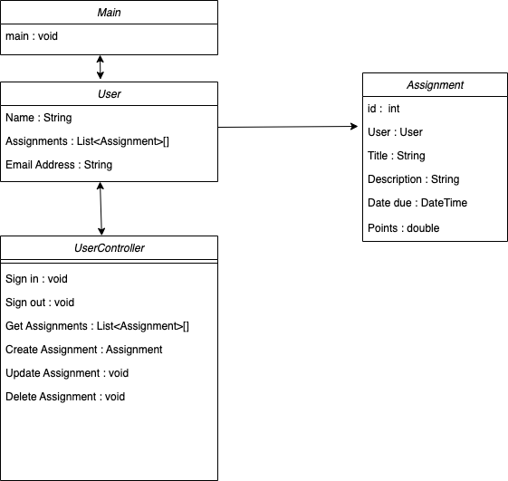

# README

## Introduction

Our team has decided to create a assignemt/task management application. Users can track pending, in progress, completed, and archived tasks. The tasks will be represented by a Post-it style note that will be ordered in columns representing the assignment's status.

## Story Board

## Functional Requirements

### Requirement 1: Assignments View

#### Dependencies

User is created and logged in. Assignments are created.

#### Scenario

As a user, I want to be able to quickly monitor, add, update, and modify a visual representation of assignments.

### Example 1

**Given** that the app is online and assignments are available

**When** on the main page

**Then** I can review assignment status, due date, and estimated hours or work (points)

### Requirement 2: Assignments View - Create Modal

#### Dependencies

User is created and logged in.

### Example 2

**Given** that the app is online and assignments are available

**When** on the main page

**Then** I can create a new assignment

### Requirement 3: Assignments View - Update Modal

#### Dependencies

User is created and logged in. Assignments are created.

### Example 2

**Given** that the app is online and assignments are available

**When** on the main page

**Then** I can edit and update the status of an assignment

### Requirement 4: Assignments View - Assignment component

#### Dependencies

User is created and logged in. Assignments are created.

### Example 2

**Given** that the app is online and assignments are available

**When** on the main page

**Then** I can delete an assignment.

## Class Diagram

## Class Diagram Description

- Main: Main screen the users sees.Shows columns of assignments and controls to add, update, and delete assignments
- User: User model.
- Assignment: Assignment model.
- UserController: Controller for User model.

## Scrum

- UI specialist: Robert Champion, Jeremy Shepherd
- Product Owner:Jeremy Shepherd
- Integration Specialist: Robert Champion, Jeremy Shepherd

## Teams Link

4pm every Sunday(TBD)
[Team Link](TBD)
